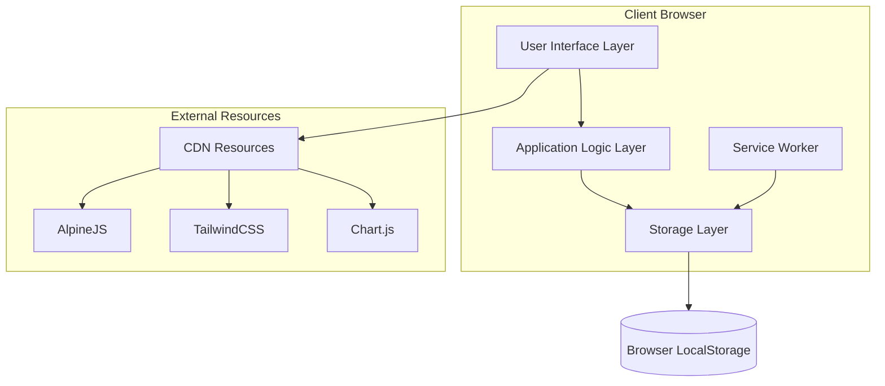
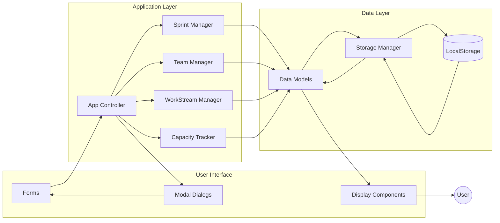
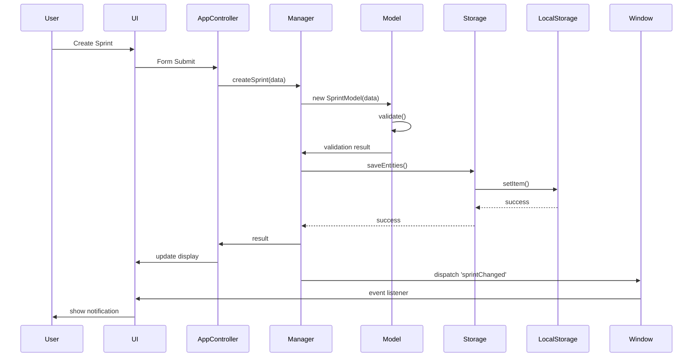
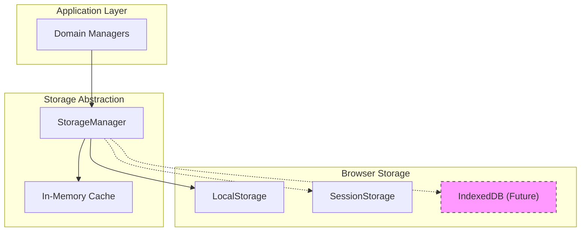
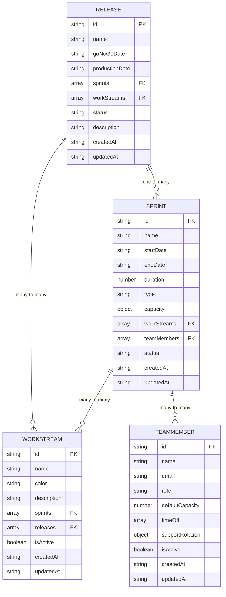
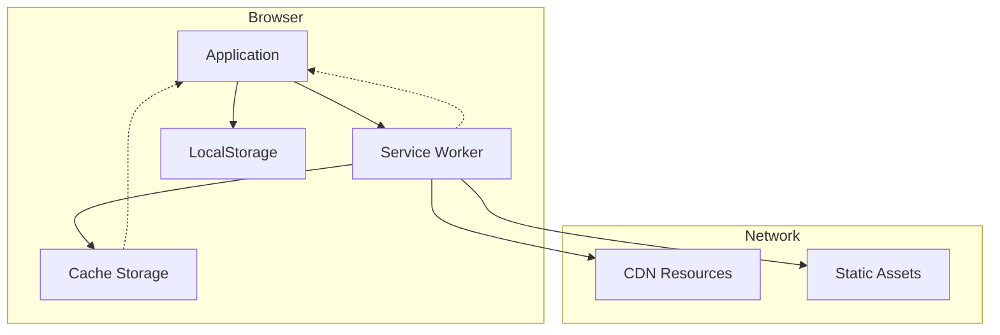
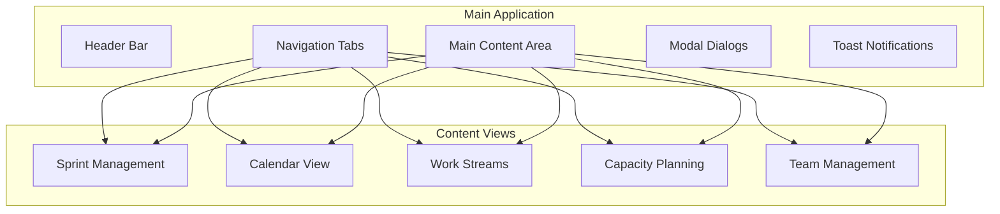
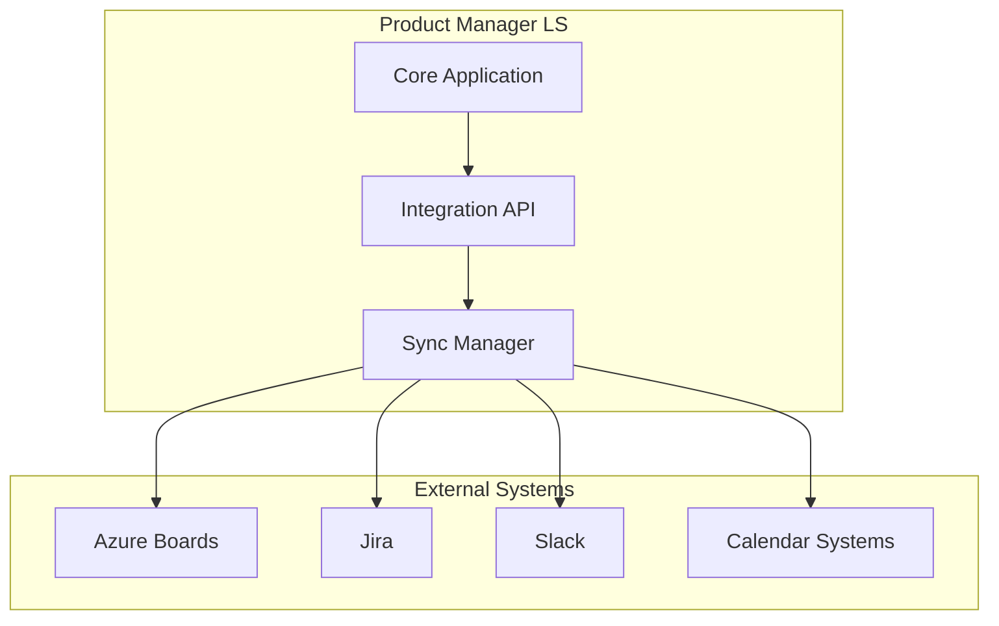
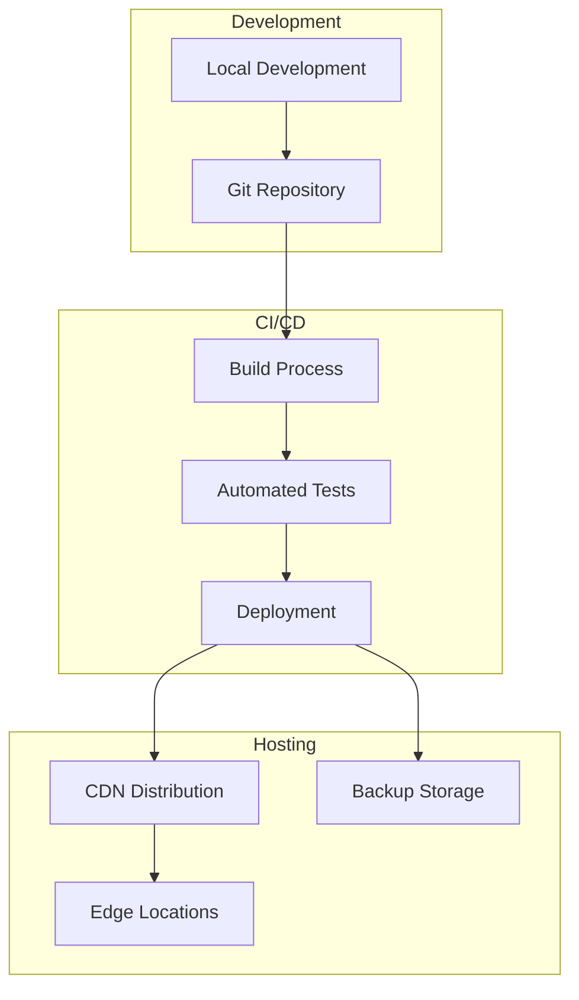

# Product Manager LS - Architecture Documentation

## Overview

Product Manager LS is designed as an offline-first Progressive Web Application (PWA) with a modular architecture that supports agile project management workflows. This document provides a comprehensive overview of the system architecture, data flow, component structure, and design decisions.

## Table of Contents

1. [System Architecture](#system-architecture)
2. [Data Flow](#data-flow)
3. [Component Architecture](#component-architecture)
4. [Storage Layer](#storage-layer)
5. [Service Worker & Offline Strategy](#service-worker--offline-strategy)
6. [UI/UX Architecture](#uiux-architecture)
7. [Security Architecture](#security-architecture)
8. [Performance Architecture](#performance-architecture)
9. [Integration Points](#integration-points)
10. [Deployment Architecture](#deployment-architecture)

## System Architecture

### High-Level Architecture



### Core Principles

#### 1. Offline-First Design
- All functionality works without internet connection
- Data persisted locally using browser storage
- Progressive enhancement for online features
- Service worker for resource caching

#### 2. Component-Based Architecture
- Modular managers for each domain area
- Clear separation of concerns
- Reusable components and utilities
- Event-driven communication

#### 3. Data-Centric Design
- Structured data models with validation
- Consistent CRUD operations
- Atomic data transactions
- Export/import capabilities

#### 4. Progressive Web App (PWA)
- Installable application experience
- Responsive design for all devices
- App-like navigation and interactions
- Background sync capabilities

### Technology Stack

| Layer | Technology | Purpose |
|-------|------------|----------|
| **Frontend Framework** | AlpineJS | Reactive UI components |
| **Styling** | TailwindCSS | Utility-first CSS framework |
| **Charts** | Chart.js | Data visualization |
| **Storage** | LocalStorage | Client-side data persistence |
| **Offline** | Service Worker | Offline functionality |
| **Deployment** | Static Files | No backend required |

### Architecture Patterns

#### Model-View-Controller (MVC)
- **Models**: Data structures and validation (`models.js`)
- **Views**: HTML templates with AlpineJS directives
- **Controllers**: Manager classes handling business logic

#### Observer Pattern
- Custom event system for component communication
- Reactive UI updates based on data changes
- Decoupled component interactions

#### Repository Pattern
- StorageManager as data access layer
- Consistent interface for CRUD operations
- Abstraction over LocalStorage implementation

## Data Flow

### Application Data Flow



### Event Flow



### Data Synchronization

#### Local Data Consistency
1. **Atomic Operations**: All data changes are atomic
2. **Validation**: Data validated before storage
3. **Error Handling**: Failed operations don't corrupt data
4. **Event Notifications**: Components notified of changes

#### Cross-Component Data Sharing
```javascript
// Event-based data sharing
window.addEventListener('sprintChanged', (event) => {
    const { action, sprint } = event.detail;
    // Update dependent components
});

// Direct data access through managers
const sprints = window.sprintManager.getAllSprints();
const teamCapacity = window.capacityTracker.calculateTeamCapacity(sprintId);
```

## Component Architecture

### Core Components Structure

```
src/
├── app.js                 # Main application controller
├── storage/
│   ├── storage.js         # Storage manager
│   └── models.js          # Data models
├── sprints/
│   └── sprint-manager.js  # Sprint business logic
├── workstreams/
│   └── workstream-manager.js # Work stream logic
└── team/
    ├── team-manager.js    # Team management logic
    └── capacity-tracker.js # Capacity calculations
```

### Component Responsibilities

#### Application Controller (`app.js`)
- **Purpose**: Central application state and UI coordination
- **Responsibilities**:
  - UI state management
  - User interaction handling
  - Component coordination
  - Event routing
  - Notification management

```javascript
// Key architectural patterns in app.js
function sprintApp() {
    return {
        // State management
        currentView: 'sprints',
        loading: false,
        
        // Event coordination
        init() {
            this.setupEventListeners();
            this.loadInitialData();
        },
        
        // UI coordination
        saveSprint() {
            const result = window.sprintManager.createSprint(this.sprintForm);
            this.handleResult(result);
        }
    };
}
```

#### Data Models (`models.js`)
- **Purpose**: Data structure definition and validation
- **Responsibilities**:
  - Schema definition
  - Data validation
  - Business rule enforcement
  - Serialization/deserialization

```javascript
// Model architecture pattern
class SprintModel {
    constructor(data = {}) {
        this.id = data.id || this.generateId();
        // ... property initialization
    }
    
    validate() {
        // Validation logic
        return { isValid: boolean, errors: string[] };
    }
    
    toJSON() {
        // Serialization for storage
    }
}
```

#### Managers (Business Logic Layer)
- **Purpose**: Domain-specific business logic
- **Responsibilities**:
  - CRUD operations
  - Business rule implementation
  - Data relationships
  - Event dispatching

```javascript
// Manager architecture pattern
class SprintManager {
    constructor() {
        this.storage = window.storageManager;
        this.sprints = this.loadSprints();
    }
    
    createSprint(data) {
        // 1. Create model
        // 2. Validate
        // 3. Save to storage
        // 4. Dispatch events
        // 5. Return result
    }
}
```

#### Storage Manager (`storage.js`)
- **Purpose**: Data persistence abstraction
- **Responsibilities**:
  - LocalStorage operations
  - Data serialization
  - Error handling
  - Storage quota management

### Component Communication

#### Direct Method Calls
```javascript
// Direct access for read operations
const sprints = window.sprintManager.getAllSprints();
const capacity = window.capacityTracker.calculateTeamCapacity(sprintId);
```

#### Event-Based Communication
```javascript
// Event dispatch for state changes
window.dispatchEvent(new CustomEvent('sprintChanged', {
    detail: { action: 'created', sprint: sprintModel }
}));

// Event listening for reactive updates
window.addEventListener('sprintChanged', (event) => {
    this.loadSprints(); // Refresh UI
});
```

#### Global State Access
```javascript
// Global manager availability
window.sprintManager = new SprintManager();
window.teamManager = new TeamManager();
window.workStreamManager = new WorkStreamManager();
```

## Storage Layer

### Storage Architecture



### Data Schema

#### Storage Keys
- `sprints` - Array of sprint objects
- `workStreams` - Array of work stream objects
- `teamMembers` - Array of team member objects
- `releases` - Array of release objects (future)
- `settings` - Application settings (future)

#### Data Relationships



### Storage Operations

#### Atomic Operations
```javascript
class StorageManager {
    saveEntities(key, data) {
        try {
            // Validate before save
            const serialized = JSON.stringify(data);
            
            // Atomic write operation
            localStorage.setItem(key, serialized);
            
            return true;
        } catch (error) {
            // Handle quota exceeded, serialization errors
            this.handleStorageError(error, 'save', key);
            return false;
        }
    }
    
    getEntities(key) {
        try {
            const data = localStorage.getItem(key);
            return data ? JSON.parse(data) : [];
        } catch (error) {
            this.handleStorageError(error, 'load', key);
            return [];
        }
    }
}
```

#### Data Validation
```javascript
// Pre-storage validation
function validateBeforeSave(entities, modelType) {
    return entities.every(entity => {
        const model = ModelFactory.create(modelType, entity);
        const validation = model.validate();
        
        if (!validation.isValid) {
            console.error(`Invalid ${modelType}:`, validation.errors);
            return false;
        }
        
        return true;
    });
}
```

#### Error Handling
```javascript
// Storage error management
handleStorageError(error, operation, key) {
    const errorEvent = new CustomEvent('storageError', {
        detail: {
            message: `Storage ${operation} failed for ${key}`,
            operation,
            key,
            error: error.message
        }
    });
    
    window.dispatchEvent(errorEvent);
    console.error('Storage error:', error);
}
```

### Storage Optimization

#### Data Compression
```javascript
// Remove unnecessary data before storage
function optimizeForStorage(data) {
    return data.map(item => {
        const optimized = {};
        
        Object.entries(item).forEach(([key, value]) => {
            // Skip null/undefined values
            if (value !== null && value !== undefined) {
                // Skip empty arrays
                if (!(Array.isArray(value) && value.length === 0)) {
                    optimized[key] = value;
                }
            }
        });
        
        return optimized;
    });
}
```

#### Quota Management
```javascript
// Monitor storage usage
function monitorStorageQuota() {
    if ('storage' in navigator && 'estimate' in navigator.storage) {
        return navigator.storage.estimate();
    }
    
    // Fallback estimation
    const used = JSON.stringify(localStorage).length;
    const estimated = 5 * 1024 * 1024; // 5MB typical limit
    
    return Promise.resolve({
        usage: used,
        quota: estimated,
        usagePercentage: (used / estimated) * 100
    });
}
```

## Service Worker & Offline Strategy

### Offline Architecture



### Caching Strategy

#### Cache-First for Static Resources
```javascript
// Service worker caching strategy
self.addEventListener('fetch', (event) => {
    // Cache-first for app resources
    if (event.request.url.includes('/src/') || 
        event.request.url.includes('/index.html')) {
        
        event.respondWith(
            caches.match(event.request)
                .then(response => {
                    // Return cached version or fetch from network
                    return response || fetch(event.request);
                })
        );
    }
    
    // Network-first for CDN resources
    if (event.request.url.includes('cdn.')) {
        event.respondWith(
            fetch(event.request)
                .catch(() => caches.match(event.request))
        );
    }
});
```

#### Background Sync (Future)
```javascript
// Prepare for background sync
self.addEventListener('sync', (event) => {
    if (event.tag === 'background-sync') {
        event.waitUntil(
            // Sync data when network available
            syncDataWithServer()
        );
    }
});
```

### PWA Capabilities

#### Manifest Configuration
```json
{
  "name": "Product Manager LS",
  "short_name": "PM-LS",
  "start_url": "/",
  "display": "standalone",
  "theme_color": "#2563eb",
  "background_color": "#f3f4f6",
  "icons": [...],
  "shortcuts": [...]
}
```

#### Install Prompt Handling
```javascript
// PWA installation
let deferredPrompt;

window.addEventListener('beforeinstallprompt', (e) => {
    e.preventDefault();
    deferredPrompt = e;
    // Show custom install button
});

function installApp() {
    if (deferredPrompt) {
        deferredPrompt.prompt();
        deferredPrompt.userChoice.then((choiceResult) => {
            deferredPrompt = null;
        });
    }
}
```

## UI/UX Architecture

### Component Structure



### Responsive Design Strategy

#### Mobile-First Approach
```html
<!-- Responsive grid layout -->
<div class="grid gap-4 md:grid-cols-2 lg:grid-cols-3">
    <!-- Sprint cards adapt to screen size -->
</div>

<!-- Responsive navigation -->
<nav class="border-b border-gray-200">
    <ul class="flex space-x-8 overflow-x-auto">
        <!-- Tabs scroll horizontally on mobile -->
    </ul>
</nav>
```

#### Adaptive UI Components
```javascript
// Responsive modal sizing
function getModalSize() {
    const isMobile = window.innerWidth < 768;
    return isMobile ? 'w-full mx-4' : 'w-96 mx-auto';
}
```

### AlpineJS Integration

#### Reactive Data Binding
```html
<!-- Two-way data binding -->
<input type="text" 
       x-model="sprintForm.name"
       class="form-input">

<!-- Conditional rendering -->
<div x-show="currentView === 'sprints'" 
     x-transition>
    <!-- Sprint content -->
</div>

<!-- Event handling -->
<button @click="saveSprint()" 
        :disabled="loading"
        class="btn-primary">
    <span x-text="editingSprintId ? 'Update' : 'Create'"></span>
</button>
```

#### Component State Management
```javascript
// AlpineJS component pattern
function sprintComponent() {
    return {
        // Local state
        sprints: [],
        loading: false,
        
        // Lifecycle
        init() {
            this.loadSprints();
        },
        
        // Methods
        async loadSprints() {
            this.loading = true;
            this.sprints = await window.sprintManager.getAllSprints();
            this.loading = false;
        }
    };
}
```

### TailwindCSS Architecture

#### Design System
```css
/* Custom utility classes */
.sprint-type-development { @apply bg-blue-100 text-blue-800; }
.capacity-normal { @apply bg-green-500; }
.capacity-high { @apply bg-yellow-500; }
.capacity-over { @apply bg-red-500; }

/* Component variants */
.btn-primary { @apply bg-blue-600 hover:bg-blue-700 text-white px-4 py-2 rounded; }
.card { @apply bg-white rounded-lg shadow-md p-6 border border-gray-200; }
```

#### Responsive Utilities
```html
<!-- Progressive enhancement -->
<div class="p-4 md:p-6 lg:p-8">
    <h1 class="text-xl md:text-2xl lg:text-3xl font-bold">
        <!-- Scales with screen size -->
    </h1>
</div>
```

### Accessibility Architecture

#### WCAG 2.1 AA Compliance
```html
<!-- Semantic HTML -->
<nav role="navigation" aria-label="Main navigation">
    <ul>
        <li><button aria-current="page">Sprints</button></li>
    </ul>
</nav>

<!-- Form accessibility -->
<label for="sprint-name" class="sr-only">Sprint Name</label>
<input id="sprint-name" 
       type="text" 
       aria-required="true"
       aria-describedby="sprint-name-error">
<div id="sprint-name-error" role="alert">Error message</div>

<!-- Focus management -->
<div x-trap="showModal">Modal content</div>
```

#### Keyboard Navigation
```javascript
// Keyboard shortcuts
document.addEventListener('keydown', (event) => {
    if (event.key === 'Escape') {
        this.closeAllModals();
    }
    
    if ((event.ctrlKey || event.metaKey) && event.key === 'n') {
        event.preventDefault();
        this.showCreateSprintModal = true;
    }
});
```

## Security Architecture

### Client-Side Security

#### Input Validation
```javascript
// XSS Prevention
function sanitizeInput(input) {
    return input
        .replace(/</g, '&lt;')
        .replace(/>/g, '&gt;')
        .replace(/"/g, '&quot;')
        .replace(/'/g, '&#x27;')
        .trim();
}

// Data validation at model level
validate() {
    const errors = [];
    
    if (!this.name || typeof this.name !== 'string') {
        errors.push('Name must be a valid string');
    }
    
    // Sanitize and validate all inputs
    this.name = sanitizeInput(this.name);
    
    return { isValid: errors.length === 0, errors };
}
```

#### Content Security Policy
```html
<meta http-equiv="Content-Security-Policy" content="
    default-src 'self';
    script-src 'self' 'unsafe-inline' cdn.tailwindcss.com cdn.jsdelivr.net;
    style-src 'self' 'unsafe-inline' cdn.tailwindcss.com;
    connect-src 'self';
    img-src 'self' data:;
    font-src 'self';
">
```

#### Data Privacy
```javascript
// Local-only data storage
const PRIVACY_PRINCIPLES = {
    // No external data transmission
    NO_TRACKING: 'Data never leaves user device',
    
    // User controls all data
    USER_OWNERSHIP: 'User owns and controls all data',
    
    // Transparent data handling
    TRANSPARENCY: 'All data operations are client-side and visible',
    
    // Data portability
    PORTABILITY: 'Data can be exported/imported freely'
};
```

### Storage Security

#### Data Encryption (Future)
```javascript
// Prepared for client-side encryption
class SecureStorageManager {
    async encryptData(data, password) {
        // Web Crypto API implementation
        const key = await this.deriveKey(password);
        const encrypted = await crypto.subtle.encrypt(
            { name: 'AES-GCM', iv: crypto.getRandomValues(new Uint8Array(12)) },
            key,
            new TextEncoder().encode(JSON.stringify(data))
        );
        return encrypted;
    }
    
    async decryptData(encryptedData, password) {
        // Decryption implementation
    }
}
```

#### Access Control
```javascript
// Session-based access (when needed)
class AccessControl {
    checkPermission(action, resource) {
        // Role-based access control
        const userRole = this.getCurrentUserRole();
        return this.permissions[userRole]?.includes(`${action}:${resource}`);
    }
}
```

## Performance Architecture

### Loading Performance

#### Critical Path Optimization
```html
<!-- Critical resources loaded first -->
<script src="https://cdn.tailwindcss.com"></script>
<script src="src/storage/storage.js"></script>
<script src="src/storage/models.js"></script>

<!-- Non-critical resources deferred -->
<script src="https://cdn.jsdelivr.net/npm/chart.js" defer></script>
<script src="https://cdn.jsdelivr.net/npm/alpinejs@3.x.x/dist/cdn.min.js" defer></script>
```

#### Lazy Loading
```javascript
// Lazy load heavy components
function loadCapacityChart() {
    if (!window.Chart) {
        return import('https://cdn.jsdelivr.net/npm/chart.js')
            .then(() => this.renderChart());
    }
    return this.renderChart();
}

// Lazy load data
function loadSprintsOnDemand() {
    if (this.sprints.length === 0) {
        this.loadSprints();
    }
}
```

### Runtime Performance

#### Memory Management
```javascript
// Efficient data structures
class PerformantDataManager {
    constructor() {
        // Use Maps for fast lookups
        this.sprintIndex = new Map();
        this.teamMemberIndex = new Map();
        
        // Weak references for cleanup
        this.componentRefs = new WeakMap();
    }
    
    // Optimized search
    findSprint(id) {
        return this.sprintIndex.get(id);
    }
    
    // Memory cleanup
    cleanup() {
        this.sprintIndex.clear();
        this.teamMemberIndex.clear();
    }
}
```

#### Virtual Scrolling (Future)
```javascript
// For large datasets
class VirtualScrollManager {
    renderVisibleItems(containerHeight, itemHeight, totalItems) {
        const startIndex = Math.floor(this.scrollTop / itemHeight);
        const endIndex = Math.min(
            startIndex + Math.ceil(containerHeight / itemHeight),
            totalItems
        );
        
        return { startIndex, endIndex };
    }
}
```

### Storage Performance

#### Batched Operations
```javascript
// Batch storage updates
class BatchedStorageManager {
    constructor() {
        this.pendingUpdates = new Map();
        this.batchTimeout = null;
    }
    
    scheduleBatchUpdate(key, data) {
        this.pendingUpdates.set(key, data);
        
        if (this.batchTimeout) {
            clearTimeout(this.batchTimeout);
        }
        
        this.batchTimeout = setTimeout(() => {
            this.flushUpdates();
        }, 100);
    }
    
    flushUpdates() {
        for (const [key, data] of this.pendingUpdates) {
            localStorage.setItem(key, JSON.stringify(data));
        }
        this.pendingUpdates.clear();
    }
}
```

#### Compression
```javascript
// Data compression for storage
function compressData(data) {
    // Remove redundant data
    const compressed = data.map(item => {
        const minimal = {};
        
        // Only store non-default values
        Object.entries(item).forEach(([key, value]) => {
            if (value !== this.getDefaultValue(key)) {
                minimal[key] = value;
            }
        });
        
        return minimal;
    });
    
    return compressed;
}
```

## Integration Points

### Future Integration Architecture



### API Design for Integration

#### Export/Import Interface
```javascript
// Standardized data format for integration
class IntegrationAPI {
    exportForAzureBoards() {
        return {
            projects: this.mapSprintsToProjects(),
            workItems: this.mapWorkStreamsToWorkItems(),
            iterations: this.mapSprintsToIterations(),
            teams: this.mapTeamMembersToTeams()
        };
    }
    
    importFromJira(jiraData) {
        const sprints = this.mapJiraSprintsToSprints(jiraData.sprints);
        const workStreams = this.mapJiraEpicsToWorkStreams(jiraData.epics);
        
        return { sprints, workStreams };
    }
}
```

#### Webhook Support (Future)
```javascript
// Webhook handling for real-time sync
class WebhookManager {
    async handleWebhook(source, event, data) {
        switch (source) {
            case 'azure-boards':
                return this.handleAzureBoardsEvent(event, data);
            case 'jira':
                return this.handleJiraEvent(event, data);
            default:
                throw new Error(`Unknown webhook source: ${source}`);
        }
    }
    
    async handleAzureBoardsEvent(event, data) {
        if (event === 'work-item-updated') {
            // Sync work item changes
            await this.syncWorkItem(data);
        }
    }
}
```

### Plugin Architecture (Future)

```javascript
// Plugin system for extensibility
class PluginManager {
    constructor() {
        this.plugins = new Map();
        this.hooks = new Map();
    }
    
    registerPlugin(name, plugin) {
        this.plugins.set(name, plugin);
        
        // Register plugin hooks
        if (plugin.hooks) {
            Object.entries(plugin.hooks).forEach(([hook, handler]) => {
                this.addHook(hook, handler);
            });
        }
    }
    
    executeHook(hookName, ...args) {
        const handlers = this.hooks.get(hookName) || [];
        return Promise.all(handlers.map(handler => handler(...args)));
    }
}

// Example plugin
const SlackNotificationPlugin = {
    name: 'slack-notifications',
    hooks: {
        'sprint-created': async (sprint) => {
            await this.sendSlackNotification(`New sprint created: ${sprint.name}`);
        }
    }
};
```

## Deployment Architecture

### Static Deployment



### Hosting Options

#### Static Site Hosting
```yaml
# GitHub Pages deployment
name: Deploy to GitHub Pages
on:
  push:
    branches: [ main ]
jobs:
  deploy:
    runs-on: ubuntu-latest
    steps:
      - uses: actions/checkout@v2
      - name: Deploy
        uses: peaceiris/actions-gh-pages@v3
        with:
          github_token: ${{ secrets.GITHUB_TOKEN }}
          publish_dir: ./
```

#### CDN Configuration
```javascript
// Service worker CDN strategy
const CDN_STRATEGY = {
    // Cache CDN resources with fallback
    'cdn.tailwindcss.com': 'network-first',
    'cdn.jsdelivr.net': 'network-first',
    
    // Cache app resources aggressively
    '/src/': 'cache-first',
    '/index.html': 'network-first'
};
```

### Environment Configuration

#### Development Environment
```javascript
// Development configuration
const DEV_CONFIG = {
    enableDebugMode: true,
    enableServiceWorker: false,
    logLevel: 'debug',
    enablePerformanceMonitoring: true
};
```

#### Production Environment
```javascript
// Production configuration
const PROD_CONFIG = {
    enableDebugMode: false,
    enableServiceWorker: true,
    logLevel: 'error',
    enablePerformanceMonitoring: false,
    enableCompression: true
};
```

### Monitoring and Analytics

#### Performance Monitoring
```javascript
// Performance tracking
class PerformanceMonitor {
    trackPageLoad() {
        window.addEventListener('load', () => {
            const perf = performance.getEntriesByType('navigation')[0];
            this.reportMetric('page-load-time', perf.loadEventEnd - perf.fetchStart);
        });
    }
    
    trackUserInteraction(action) {
        const start = performance.now();
        
        return () => {
            const duration = performance.now() - start;
            this.reportMetric(`action-${action}`, duration);
        };
    }
}
```

#### Error Tracking
```javascript
// Error monitoring
class ErrorMonitor {
    constructor() {
        window.addEventListener('error', this.handleError.bind(this));
        window.addEventListener('unhandledrejection', this.handleRejection.bind(this));
    }
    
    handleError(event) {
        this.reportError({
            type: 'javascript-error',
            message: event.error.message,
            stack: event.error.stack,
            filename: event.filename,
            lineno: event.lineno
        });
    }
    
    handleRejection(event) {
        this.reportError({
            type: 'unhandled-promise-rejection',
            reason: event.reason
        });
    }
}
```

---

This architecture documentation provides a comprehensive overview of Product Manager LS's design, implementation patterns, and technical decisions. The modular, offline-first architecture ensures scalability, maintainability, and excellent user experience across different environments and use cases.